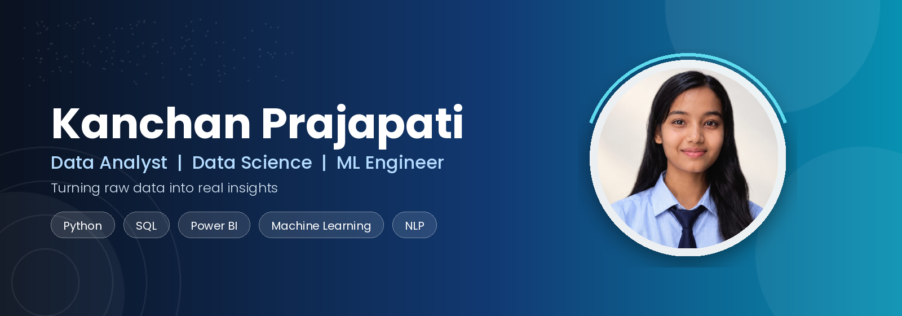

---

## 🌟 About Me

I'm an **MCA student specializing in Artificial Intelligence & Machine Learning with SAS**, passionate about **Data Analytics, Data Science, Machine Learning, and NLP**.

I like turning raw data into patterns, dashboards, and models that actually mean something. Through academic and personal projects, I've built hands-on experience in **data preprocessing, exploratory analysis, machine learning, dashboards, and predictive modelling.**

- 🔭 Currently strengthening my **technical, analytical, and problem-solving skills** through real projects
- 🌱 Continuously learning new tools in **Data Science and NLP**
- 🎯 **Goal:** Grow into a Data/AI professional who turns data into useful insights and intelligent solutions

---

## 🎓 Education

| Degree | Institute | Duration | Score |
|---|---|---|---|
| **MCA** — AI & ML with SAS | Poornima University, Jaipur | 2025 – 2027 | Ongoing |
| **BCA** | Alankar Mahila P.G. Mahavidyalaya, Jaipur (Rajasthan University) | 2022 – 2025 | 74.60% |

---

## 🛠️ Tech Stack

**Programming & Data**

**Machine Learning & NLP**

**Analytics & Visualization**

**Tools & Platforms**

---

## 🚀 Featured Projects

### 📊 Customer Churn Prediction
Predicts customer churn using EDA, preprocessing, and classification models to flag at-risk customers.
`Python` `Pandas` `NumPy` `Scikit-learn` `Data Analysis`

### 🚗 Car Price Prediction
Estimates resale car prices from vehicle features using regression-based machine learning.
`Python` `Pandas` `Scikit-learn` `Machine Learning`

### 🏨 Hotel Revenue Insights
Interactive Power BI dashboard exploring hotel revenue, booking patterns, and customer metrics.
`Power BI` `SQL` `Data Visualization` `Business Analytics`

### 🔎 Google Trends Technology Analysis
Compares technology search trends across time with an interactive dashboard.
`Python` `Streamlit` `Power BI` `Data Visualization`

---

## 🏅 Certifications & Badges

- 🟦 Base SAS Programming
- 🟦 SAS Viya
- 🟦 Machine Learning Using SAS
- 🟦 Statistics Using SAS
- 🟦 AI Tools & Prompt Engineering

---

## 🌱 Currently Learning

`NLP` · `Machine Learning` · `Data Analytics & Data Science` · `Data Visualization & Dashboarding` · `Optimization Techniques` · `Professional Communication`

---

## 💡 Core Strengths

| Strength | Focus |
|---|---|
| 📊 Analytical Thinking | Finding patterns and insights in data |
| 🧩 Problem Solving | Turning real-world problems into practical solutions |
| 📚 Continuous Learning | Picking up new tools and concepts quickly |
| 🤝 Collaboration | Working well with teams and sharing ideas |
| 💬 Communication | Explaining findings clearly and confidently |
| 🎯 Growth Mindset | Learning from feedback and iterating |

---

## 📌 What I'm Looking For

- Roles working with real-world datasets and analytical problems
- Opportunities to build practical data / ML solutions
- Mentorship from experienced professionals
- Projects with genuine business impact
- Room to grow into a strong Data/AI professional

---

## 📫 Connect With Me

---

> **"You can't cross the sea merely by standing and staring at the water."**
> — *Rabindranath Tagore*

### Learn • Build • Analyze • Improve • Grow 🚀

**Thanks for visiting my profile! 💙**

